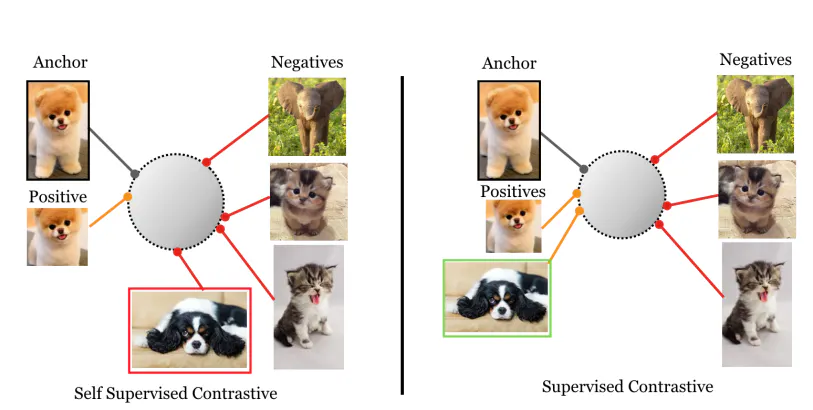
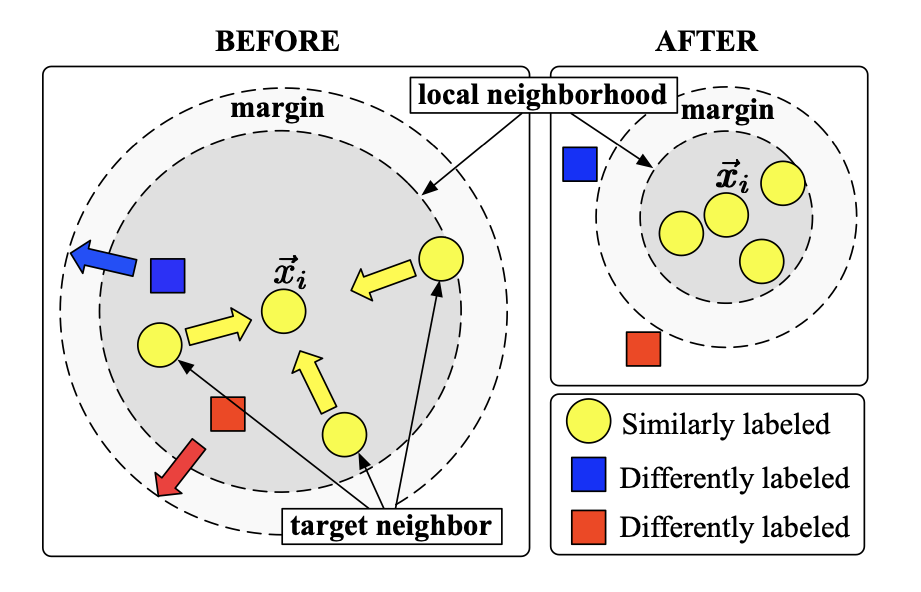
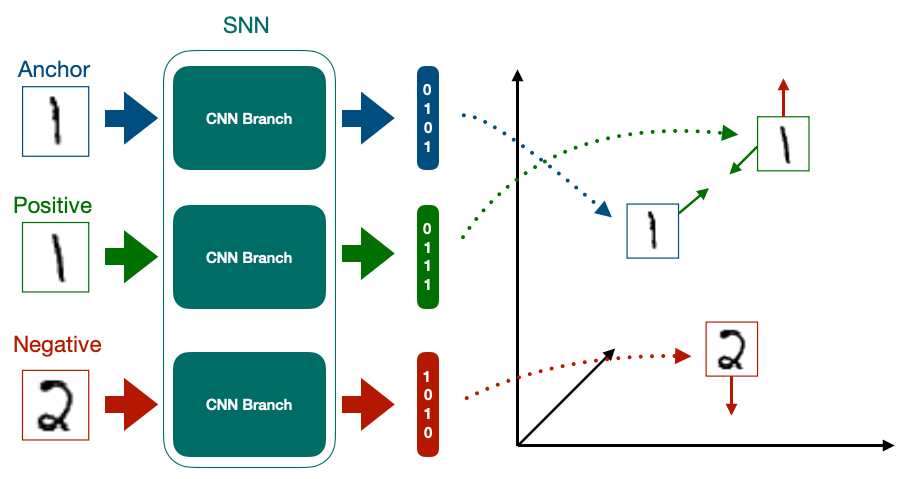

<script>
MathJax = {
  tex: {
    inlineMath: [['$', '$'], ['\\(', '\\)']]
  }
};
</script>
<script type="text/javascript" id="MathJax-script" async
  src="https://cdn.jsdelivr.net/npm/mathjax@3/es5/tex-mml-chtml.js">
</script>
<script id="MathJax-script" async
  src="https://cdn.jsdelivr.net/npm/mathjax@3/es5/tex-chtml.js">
</script>

# Triplet Loss

Despite the name of the blog that first introduces a Loss Function, this is not the first thing we think when we are designing the solution to our problem under a NN perspective. Said this, let's first talk about the context that our Loss function features.

## Constrastive learning

Contrastive learning is an approach to learning that focuses on extracting meaningful representations by contrasting positive and negative pairs of instances. It leverages the assumption that similar instances should be closer together in a learned embedding space, while dissimilar instances should be farther apart.

Contrastive learning can appear as a supervised learning approach where the pairs of data points are already annotated with their labels, indicating whether they are are similar or dissimilar with each other. However a very common use of contrastive learning comes in the unsupervised learning area where adaptively learn how to distance unsimiliar instances by generating a set of similar samples from a single intance through data augmentation techniques.



Depending on your objetive, using the data augmentation over a single instance can harm your model in the sense of creating sparse representations in the representation space once an instance of data is only forced to be together with it's augmented forms, which tend to have high similarity.

## Preceedings of the contrastive learning intuition

In this section I'll just pass through a breef summary of a cool stuff that I found in the time box that can show how old the constrastive learning perspective/idea is.

Back to 2005, researches from University of Pensylvanya published a paper[1](https://proceedings.neurips.cc/paper_files/paper/2005/file/a7f592cef8b130a6967a90617db5681b-Paper.pdf) - approved in the Neurips conference of the same year - that had the goal of learning a Mahalanobis distance for the k-nearest neighbor (kNN) classification. To better approach the problem, the actual goal to address the problem was to learn a Linear Transformation that optimizes the kNN classification.

$$D(x_i, x_j) = ||L(x_i − x_j )||^2.$$

To approach the learning of these Linear Transformations, the author suggested a cost function that introduces the idea of optimizing through two competing terms:

$$\sum_{ij} \eta_{ij} ||L(x_i - x_j)||^2 + c \sum_{ijl} \eta_{ij} (1 - y_{il}) [1 + ||L(x_i - x_j)||^2 - ||L(x_i - x_l)||^2] +$$
where:

- $y_{il}$: indicates whether labels $y_i$ and $y_l$ match
- $\eta_{ij}$: indicates whether $x_j$ is a target neighbor of $x_i$


The second term in the cost function incorporates the idea of a margin. In particular, for each input $x_i$, the hinge loss is incurred by differently labeled inputs whose distances do not exceed, by one absolute unit of distance, the distance from input $x_i$ to any of its target neighbors. The cost function thereby favors distance metrics in which differently labeled inputs maintain a large margin of distance and do not threaten to “invade” each other’s neighborhoods.



## Siamese Neural Networks

As we talked earlier about the contrastive learning and it's foundations, let's now talk about a very common neural network architecture used in cases where we want to approach the problem through contrastive learning, the Siamese Network.

For a briefly introduction, a Siamese network is an artificial neural network that contains two or more identical sub-networks i.e. they have the same configuration with the same parameters and weights. The number of the sub-networks involved can vary depending on the kind of the Loss Function.



This type of networks usually follows the basic steps of encoding the information coming from each instance, doing a postprocessing such as pooling, passing each pair to a distance measure function and then calculates the loss.

## Triplet Loss

Finally to our loss function, the Triplet Loss helps our network adjusting the embedding function such that we map similar instances closer and unsimilar instances far apart.

Talking about it's implementation, each training samples consists of three instances of 
data (could be phrases, images, etc): an anchor, a positive instance and a negative instance. These instances will pass through the siamese networks so it computes the embeddings for each one of them and postprocess the embedding vectors such that they have the same length. Finally these vectors are given as entries to our Triplet Loss function.

$$ L(a,p,n) = max\{d(a_i, p_i) - d(a_i, n_i) + margin, 0\}$$

Let's take a look inside a possible implementation:
```python
    import torch
    from torch.nn import functional as F

    def triplet_loss(anchor, positive, negative, margin=1.0):
    """
    Calculates the Triplet Loss between given inputs.

    Args:
        anchor: Embedding of the anchor sentence.
        positive: Embedding of a sentence similar to the anchor.
        negative: Embedding of a sentence dissimilar to the anchor.
        margin: Margin value for the Triplet Loss.

    Returns:
        A tensor representing the Triplet Loss value.
    """
        positive_dist = F.pairwise_distance(anchor, positive, keepdim=True)
        negative_dist = F.pairwise_distance(anchor, negative, keepdim=True)

        loss = F.relu(positive_dist - negative_dist + margin)

        return loss.mean()
```

For the standard Triplet Loss function, the distance measure established is the Euclidean distance. As a modifier there is also the [TripletMarginWithDistanceLoss](https://pytorch.org/docs/stable/generated/torch.nn.TripletMarginWithDistanceLoss.html#torch.nn.TripletMarginWithDistanceLoss) function in Pytorch where you can set your own distance measure.

## Code example

Following the inspiration for this article, the Sentence Bert, I'll presente a little piece of code where we can see an example for NLP following the basic Siamese Networks steps that I've commented later in this post.

```python
from transformers import BertTokenizer
from transformers import BertModel
from torch import nn

# Defining the BERT model to generate the embeddings
tokenizer = BertTokenizer.from_pretrained('bert-base-uncased')
model = BertModel.from_pretrained('bert-base-uncased')

# Defining the Triplet Loss with Euclidean Distance function
criteria = nn.TripletMarginLoss(margin=1.0, p=2)

def encode_sentence(sentence):
    tokens = tokenizer(sentence, add_special_tokens=True, return_tensors='pt', max_length=128, padding='max_length', truncation=True)
    return tokens['input_ids'], tokens['attention_mask']

def simple_forward(anchor, positive, negative):
    # Generating the tokens from our sentence
    input_ids1, attention_mask1 = encode_sentence(anchor)
    input_ids2, attention_mask2 = encode_sentence(positive)
    input_ids3, attention_mask3 = encode_sentence(negative)

    # Get the pooled output from the model for each instance
    anchoer_emb = model(input_ids1, attention_mask1)[1]
    positive_emb = model(input_ids2, attention_mask2)[1]
    negative_emb = model(input_ids3, attention_mask3)[1]

    # Compute the loss
    loss = criteria(anchoer_emb, positive_emb, negative_emb)
    return loss

first_sample = {
    "anchor": "I like trucks",
    "positive": "I love trucks",
    "negative": "Pigs can't fly"
}

second_sample = {
    "anchor": "I like trucks",
    "positive": "Pigs can't fly",
    "negative": "I love trucks"
}

simple_forward(**first_sample) # tensor(0., grad_fn=<MeanBackward0>)
simple_forward(**second_sample) # tensor(4.5003, grad_fn=<MeanBackward0>)
```

## References
- `Paper` [FaceNet: A Unified Embedding for Face Recognition and Clustering](https://arxiv.org/pdf/1503.03832.pdf)
- `Article` [Full Guide to Contrastive Learning](https://encord.com/blog/guide-to-contrastive-learning/#:~:text=Contrastive%20learning%20is%20an%20approach,instances%20should%20be%20farther%20apart.)
- `Paper` [Distance Metric Learning for Large Margin Nearest Neighbor Classification](https://proceedings.neurips.cc/paper_files/paper/2005/file/a7f592cef8b130a6967a90617db5681b-Paper.pdf)
- `Article` [A Comprehensive Guide to Siamese Neural Networks](https://medium.com/@rinkinag24/a-comprehensive-guide-to-siamese-neural-networks-3358658c0513)
- `Paper` [Sentence-BERT: Sentence Embeddings using Siamese BERT-Networks](https://arxiv.org/pdf/1908.10084.pdf)
- `Video` [C4W4L04 Triplet loss - DeepLearningAI](https://www.youtube.com/watch?v=d2XB5-tuCWU)
- `Article` [A friendly Introduction to Siamese Networks](https://towardsdatascience.com/a-friendly-introduction-to-siamese-networks-85ab17522942)
- `Documentation` [TRIPLETMARGINLOSS](https://pytorch.org/docs/stable/generated/torch.nn.TripletMarginLoss.html#torch.nn.TripletMarginLoss)